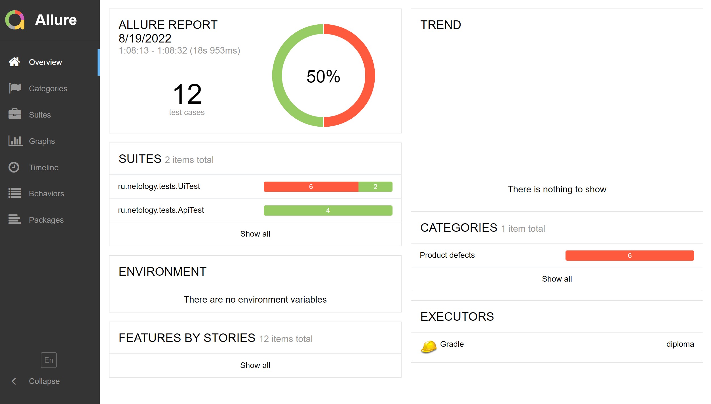

## Отчет по итогам тестирования
### Краткое описание
В ходе тестирования был проверен веб-сервис "Путешествие дня", которое представляет из себя комплексный сервис, взаимодействующий с СУБД и API Банка.
 
Было проведено ручное тестирование.
Далее разработан план автоматизации тестирования.
Написаны автотесты, и проведено автоматизированное тестирование сервиса.
Автоматизирвоанные тесты включают в себя как позитивные, так и негативные сценарии и покрывают UI, API и DB приложения.

Тестирование проведено для двух БД: MySQL и PostgreSQL.
### Количество тест-кейсов - 12 , из них
- успешных - 6
- неуспешных - 6

### Общие рекомендации
1. Разработать документацию приложения
2. Исправить опечатку в поле "Марракэш"
3. Исправить отправку уведомлений: 
- уведомление должно приходить одно
- желательно разделить цветом успешые и ошибочные уведомления
- убрать дублирование слова "Ошибка" в ошибочном уведомлении
4. Поле "Номер карты":
- убрать ввод данных с пробелом номера для API
5. Поле "Месяц":
- убрать возможность ввода значения "00"
6. Поле "Владелец":
- сделать обработку невалидных значений( цифры, символы, только имя)
- установить ограничение символов
7. Добавить кооректную обработку ошибок в API